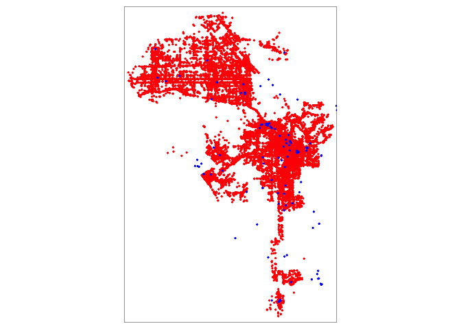
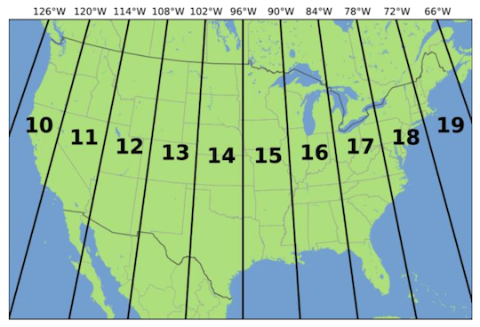
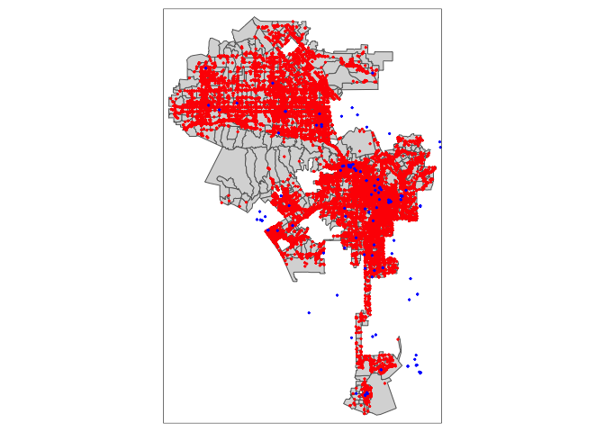
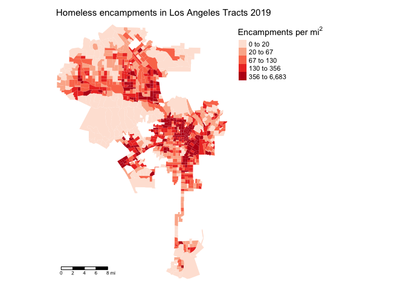
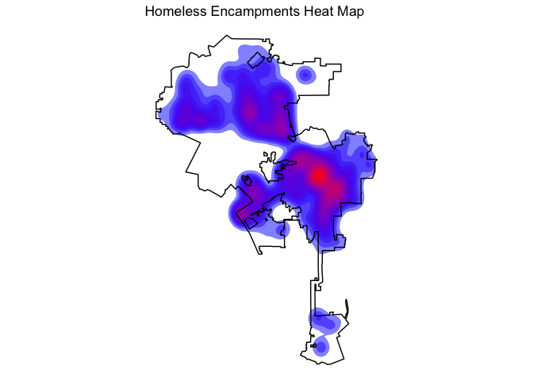

# geospatial-open-data

<a href="http://creativecommons.org/licenses/by-nc/4.0/" rel="license"></a>
This tutorial is licensed under a <a href="http://creativecommons.org/licenses/by-nc/4.0/" rel="license">Creative Commons Attribution-NonCommercial 4.0 International License</a>.

# Acknowledgements
This lab is sourced from and adapted from Professor Noli Brazil's course on <a href="https://crd230.github.io/index.html"> "Spatial Methods in Community Research" </a> and Manuel Giomond's <a href="https://mgimond.github.io/Spatial/index.html"> "Intro to GIS and Spatial Analysis" </a> curriculum.

# Instructions
For this lab, you will provide:
1. .R script file (<b>not</b> an R Markdown file)
2. A .docx file with: maps #1-6 as well as written answers for "questions" #1-2. 

# Map 1-2
Using Census tract data and relying on what you learned in class, create a 2 static choropleth map of St. Joseph County: 1) percent of total asian population per census tract; 2) percent of total black population per census tract.

# Introduction

During class, we learned to process spatial data in R--particularly, areal/polygon data. This lab will talk more broadly about how to access and clean data from Open Data portals while also incorporating point data. The learning objectives are as follows:

1. Learn how to read in point data
2. Gain better understanding of Coordinate Reference Systems
3. Learn how to reproject spatial data
4. Learn how to bring in data from OpenStreetMap
5. Learn how to map point data

To achieve these objectives, we will first examine the spatial distribution of homeless encampments in the City of Los Angeles using 311 data downloaded from the city’s <a href="https://data.lacity.org/"> open data portal</a>. This lab guide follows closely and supplements the material presented in the textbook <a href="https://geocompr.robinlovelace.net/"> Geocomputation with R</a>

# Packages
```R
install.packages("sf")
install.packages("tidyverse")
install.packages("units")
install.packages("tmap")
install.packages("tidycensus")
install.packages("tigris")
install.packages("rmapshaper")
install.packages("tidygeocoder")
install.packages("leaflet")
install.packages("osmdata")
```

```R
library(sf)
library(tidyverse)
library(units)
library(tmap)
library(tidycensus)
library(tigris)
library(rmapshaper)
library(tidygeocoder)
library(leaflet)
library(osmdata)
```


# Reading in census tract data

We will need to bring in census tract polygon features and racial composition data from the 2015-2019 American Community Survey using the Census API and keep tracts within Los Angeles city boundaries using a clip. The code for accomplishing these tasks is below. There are  comments embedded within the code that briefly explain what each chunk is doing. The code ```rename_with(~ sub("E$", "", .x), everything())``` eliminates the E at the end of the variable names for the estimates. Remember in a prior lab how we brought in a long dataset and used ```spread()``` to go from long to wide?

```R
# Bring in census tract data. 
ca.tracts <- get_acs(geography = "tract", 
              year = 2017,
              variables = c(tpop = "B01003_001", tpopr = "B03002_001", 
                            nhwhite = "B03002_003", nhblk = "B03002_004",
                             nhasn = "B03002_006", hisp = "B03002_012"),
              state = "CA",
              survey = "acs5",
              output = "wide",
              geometry = TRUE)
# Make the data tidy, calculate percent race/ethnicity, and keep essential vars.
ca.tracts <- ca.tracts %>% 
  rename_with(~ sub("E$", "", .x), everything()) %>%
  mutate(pnhwhite = nhwhite/tpopr, pnhasn = nhasn/tpopr, 
              pnhblk = nhblk/tpopr, phisp = hisp/tpopr) %>%
  dplyr::select(c(GEOID,tpop, pnhwhite, pnhasn, pnhblk, phisp))  

# Bring in city boundary data
pl <- places(state = "CA", cb = TRUE)

# Keep LA city
la.city <- filter(pl, NAME == "Los Angeles")

#Clip tracts using LA boundary
la.city.tracts <- ms_clip(target = ca.tracts, clip = la.city, remove_slivers = TRUE)
```

# Reading in point data
Point data give us the locations of objects or events within an area. Events can be things like crimes and car accidents. Objects can be things like trees, houses, jump bikes or even people, such as the locations of where people were standing during a protest.

Often you will receive point data in tabular (non-spatial) form. These data can be in one of two formats

1. Point longitudes and latitudes (or X and Y coordinates)
2. Street addresses

If you have longitudes and latitudes, you have all the information you need to make the data spatial. This process involves using geographic coordinates (longitude and latitude) to place points on a map. In some cases, you won’t have coordinates but street addresses. Here, you’ll need to geocode your data, which involves converting street addresses to geographic coordinates. These tasks are intimately related to the concept of projection and reprojection, and underlying all of these concepts is the Coordinate Reference System.

# Longitude/Latitude
Best case scenario is that you have a point data set with geographic coordinates. Geographic coordinates are in the form of a longitude and latitude, where longitude is your X coordinate and spans East/West and latitude is your Y coordinate and spans North/South.

Let’s bring in a csv data set of homeless encampments in Los Angeles City, which was downloaded from the <a href="https://data.lacity.org/">Los Angeles City Open Data portal</a>. I uploaded the data set on GitHub so you can directly read it in using read_csv()

```R
homeless311.df <- read_csv("https://raw.githubusercontent.com/crd230/data/master/homeless311_la_2019.csv")
```

The data represent homeless encampment locations in 2019 as reported through the City’s 311 system. 

Viewing the file and checking its class you’ll find that homeless311.df is a regular tibble, not a spatial <b>sf</b> points object.

We will use the function ```st_as_sf()``` to create a point <b>sf</b> object of <i>homeless311.df</i>. The function requires you to specify the longitude and latitude of each point using the ```coords =``` argument, which are conveniently stored in the variables <i>Longitude</i> and <i>Latitude</i>.

```R
homeless311.sf <- st_as_sf(homeless311.df, coords = c("Longitude", "Latitude"))
```

# Street Addresses
Often you will get point data that won’t have longitude/X and latitude/Y coordinates but instead have street addresses. The process of going from address to X/Y coordinates is known as geocoding.  

To demonstrate geocoding, type in a street address, city and state of your favorite restaurant in the United States inside the quotes below.

```R
myaddress.df  <- tibble(street = "", city = "", state = "")
```
This creates a tibble with your street, city and state saved in three variables. To geocode addresses to longitude and latitude, use the function ```geocode()``` which is a part of the <b>tidygeocoder</b> package. Use ```geocode()``` as follows

```R
myaddress.df <- geocode(myaddress.df, street = street, city = city, state = state, method = "osm")
```

Here, we specify street, city and state variables. The argument ```method = 'osm' ``` specifies the geocoder used to map addresses to longitude/latitude locations, in the above case ``` 'osm' ``` stands for <a href="https://www.openstreetmap.org">OpenStreetMaps</a>. Think of R going to the OpenStreetMaps website, searching for each address, plucking the latitude and longitude of your address, and saving it in a tibble named <i>myaddress.df</i>

If you view this object, you’ll find the latitude <i>lat</i> and longitude <i>long</i> attached as columns. Convert this point to an <b>sf</b> object using the function ```st_as_sf()```.

```R
myaddress.sf <- st_as_sf(myaddress.df, coords = c("long", "lat"))
```

# Question 1
View the object and search the lat/long in Google maps. Did you get it right? Please provide the name of the establishment as well as lat/long.

Let’s now bring in a csv file containing the street addresses of homeless shelters and services in Los Angeles County , which I also downloaded from Los Angeles’ open data portal.

```R
shelters.df <- read_csv("https://raw.githubusercontent.com/crd230/data/master/Homeless_Shelters_and_Services.csv")

glimpse(shelters.df)
```

```{r}
## Rows: 182
## Columns: 23
## $ source       <chr> "211", "211", "211", "211", "211", "211", "211", "211", …
## $ ext_id       <lgl> NA, NA, NA, NA, NA, NA, NA, NA, NA, NA, NA, NA, NA, NA, …
## $ cat1         <chr> "Social Services", "Social Services", "Social Services",…
## $ cat2         <chr> "Homeless Shelters and Services", "Homeless Shelters and…
## $ cat3         <lgl> NA, NA, NA, NA, NA, NA, NA, NA, NA, NA, NA, NA, NA, NA, …
## $ org_name     <chr> NA, NA, NA, NA, NA, NA, NA, NA, NA, "www.catalystfdn.org…
## $ Name         <chr> "Special Service For Groups -  Project 180", "1736 Famil…
## $ addrln1      <chr> "420 S. San Pedro", "2116 Arlington Ave", "1736 Monterey…
## $ addrln2      <chr> NA, "Suite 200", NA, NA, NA, NA, "4th Fl.", NA, NA, NA, …
## $ city         <chr> "Los Angeles", "Los Angeles", "Hermosa Beach", "Monrovia…
## $ state        <chr> "CA", "CA", "CA", "CA", "CA", "CA", "CA", "CA", "CA", "C…
## $ hours        <chr> "SITE HOURS:  Monday through Friday, 8:30am to 4:30pm.",…
## $ email        <lgl> NA, NA, NA, NA, NA, NA, NA, NA, NA, NA, NA, NA, NA, NA, …
## $ url          <chr> "ssgmain.org/", "www.1736fcc.org", "www.1736fcc.org", "w…
## $ info1        <lgl> NA, NA, NA, NA, NA, NA, NA, NA, NA, NA, NA, NA, NA, NA, …
## $ info2        <lgl> NA, NA, NA, NA, NA, NA, NA, NA, NA, NA, NA, NA, NA, NA, …
## $ post_id      <dbl> 772, 786, 788, 794, 795, 946, 947, 1073, 1133, 1283, 135…
## $ description  <chr> "The agency provides advocacy, child care, HIV/AIDS serv…
## $ zip          <dbl> 90013, 90018, 90254, 91016, 91776, 90028, 90027, 90019, …
## $ link         <chr> "http://egis3.lacounty.gov/lms/?p=772", "http://egis3.la…
## $ use_type     <chr> "publish", "publish", "publish", "publish", "publish", "…
## $ date_updated <chr> "2017/10/30 14:43:13+00", "2017/10/06 16:28:29+00", "201…
## $ dis_status   <chr> NA, NA, NA, NA, NA, NA, NA, NA, NA, NA, NA, NA, NA, NA, …
```

The file contains no latitude and longitude data, so we need to convert the street addresses contained in the variables <i>addrln1</i>, <i>city</i> and <i>state</i>. Use the function ```geocode()```. The process will take a few minutes so be patient.

```R
shelters.geo <- geocode(shelters.df, street = addrln1, city = city, state = state, method = 'osm')
```

Look at the column names.


```R
names(shelters.geo)
```

```{r}
##  [1] "source"       "ext_id"       "cat1"         "cat2"         "cat3"        
##  [6] "org_name"     "Name"         "addrln1"      "addrln2"      "city"        
## [11] "state"        "hours"        "email"        "url"          "info1"       
## [16] "info2"        "post_id"      "description"  "zip"          "link"        
## [21] "use_type"     "date_updated" "dis_status"   "lat"          "long"
```

We see the latitudes and longitudes are attached to the variables <i>lat</i> and <i>long</i>, respectively. Notice that not all the addresses were successfully geocoded.

```R
summary(shelters.geo$lat)
```

```{r}
##    Min. 1st Qu.  Median    Mean 3rd Qu.    Max.    NA's 
##   33.74   33.98   34.05   34.06   34.10   34.70       8
```

Eight shelters received an ```NA```. This is likely because the addresses are not correct, has errors, or are not fully specified. For example, the address <i>11046 Vly</i> Mall should be written out as <i>11046 Valley Mall</i>. You’ll have to manually fix these issues, which becomes time consuming if you have a really large data set. For the purposes of this lab, let’s just discard these, but in practice, make sure to double check your address data (See the document Geocoding_Best_Practices.pdf in the Other Resources folder on Canvas for best practices for cleaning address data).

```R
shelters.geo <- shelters.geo %>%
                filter(is.na(lat) == FALSE & is.na(long) == FALSE)
```

Convert latitude and longitude data into spatial points using the function ```st_as_sf()```.

```R
shelters.sf <- st_as_sf(shelters.geo, coords = c("long", "lat"))
```

# Coordinate Reference System

Plot homeless encampments and shelters using functions from the tmap package. This is an example of a basic pin or dot map.

## Map 3

```R
tmap_mode("plot")

tm_shape(homeless311.sf) +  
  tm_dots(col="red") +
tm_shape(shelters.sf) +  
  tm_dots(col="blue")
```

```{r}
## Warning: Currect projection of shape homeless311.sf unknown. Long-lat (WGS84) is
## assumed.
```

```{r}
## Warning: Currect projection of shape shelters.sf unknown. Long-lat (WGS84) is ## assumed.
```



We get a map that looks correct. But, we did get two warnings. These warnings are not something to sneeze at - they tell us that we haven’t set a projection, which is no problem if we’re just mapping, but is no good if we want to do some spatial analyses on the point locations.

What we need to do is set the Coordinate Reference System (CRS). The CRS is an important concept to understand when dealing with spatial data. We won’t go through the real nuts and bolts of CRS, but we’ll go through enough of it so that you can get through most of the CRS related spatial data wrangling tasks in this class. In addition to GWR, Esri also has a nice explanation <a href="https://www.esri.com/arcgis-blog/products/arcgis-pro/mapping/gcs_vs_pcs/">here</a>. This <a href="https://mgimond.github.io/Spatial/coordinate-systems-in-r.html">site</a> also does a thorough job of explaining how to work with CRS in R. You can also read the document Coordinate_Reference_Systems.pdf on Canvas in the Other Resources folder.

The CRS contains two major components: the Geographic Coordinate System (GCS) and the Projected Coordinate System (PCS). A GCS uses a three-dimensional spherical surface to define locations on the earth. The GCS is composed of two parts: the ellipse and the datum. The ellipse is a model of the Earth’s shape - how the earth’s roundness is calculated. The datum defines the coordinate system of this model - the origin point and the axes. You need these two basic components to place points on Earth’s three-dimensional surface. Think of it as trying to create a globe (ellipse) and figuring out where to place points on that globe (datum).

The PCS then translates these points from a globe onto a two-dimensional space. We need to do this because were creating flat-paper or on-the-screen maps, not globes (it’s kind of hard carrying a globe around when you’re finding your way around a city).

You can find out the CRS of a spatial data set using the function ```st_crs()```.

```R
st_crs(homeless311.sf)
```

```{r}
## Coordinate Reference System: NA
```

When we used ```st_as_sf()``` above to create <i>homeless311</i>, we did not specify a CRS. We should have. Working with spatial data requires both a Geographic Coordinate System (so you know where your points are on Earth) and a Projection (a way of putting points in 2 dimensions). Both. Always. Like Peanut Butter and Jelly. Like Sonny and Cher.

There are two common ways of specifying a coordinate system in R: via the EPSG numeric <a href="http://spatialreference.org/ref/epsg/">code</a> or via the <a href="https://proj4.org/apps/proj.html">PROJ4</a> formatted string. The PROJ4 syntax consists of a list of parameters, each separated by a space and prefixed with the ```+``` character. To specify the PCS, you use the argument ```+proj=```. To specify the GCS, you use the arguments ```+ellps=``` to establish the ellipse and ```+datum=``` to specify the datum.

How do we know which CRS to use? The most common datums in North America are NAD27, NAD83 and WGS84, which has the ellipsoids clrk66, GRS80, and WGS84, respectively. The datum always specifies the ellipsoid that is used, but the ellipsoid does not specify the datum. This means you can specify ```+datum=``` and not specify ```+ellps=``` and R will know what to do, but not always the other way around. For example, the ellipsoid GRS80 is also associated with the datum GRS87, so if you specify ```ellps=GRS80``` without the datum, R won’t spit out an error, but will give you an unknown CRS. The most common datum and ellipsoid combinations are listed in Figure 1 in the Coordinate_Reference_Systems.pdf document on Canvas.

When you are bringing in point data with latitude and longitude, the projected coordinate system is already set for you. Latitudes and longitudes are X-Y coordinates, which is essentially a Plate Carree projection. You specify a PCS using the argument (in quotes) ```+proj=longlat```. Let’s use ```st_as_sf()``` again on <i>homeless311.df</i>, but this time specify the CRS using the argument ```crs```.

```R
homeless311.sf <- st_as_sf(homeless311.df, coords = c("Longitude", "Latitude"), crs = "+proj=longlat +datum=WGS84 +ellps=WGS84")
```

The CRS should have spaces only in between ```+proj=longlat```, ```+datum=WGS84``` and ```+ellps=WGS84```, and no other place. Remember, you could have just specified ```+datum=WGS84``` and R would have known what to do with the ellipsoid. What is the CRS now?

```R
st_crs(homeless311.sf)
```

We can see the PROJ4 string using

```R
st_crs(homeless311.sf)$proj4string
```

```{r}
## [1] "+proj=longlat +datum=WGS84 +no_defs"
```

Instead of a PROJ4, we can specify the CRS using the EPSG associated with a GCS and PCS combination. A EPSG is a four-five digit unique number representing a particular CRS definition. The EPSG for the particular GCS and PCS combination used to create homeless311.sf is 4326. Had we looked this up <a href="http://spatialreference.org/ref/epsg/4326/">here</a>, we could have used ```crs = 4326``` instead of ```"+proj=longlat +datum=WGS84"``` in ```st_as_sf()``` as we do below.

```R
homeless311.sf2 <- st_as_sf(homeless311.df, coords = c("Longitude", "Latitude"), crs = 4326)
```

we verify that the CRS are the same

```R
st_crs(homeless311.sf) == st_crs(homeless311.sf2)
```

```{r}
## [1] TRUE
```

Let’s set the CRS for the homeless shelter and services points

```R
shelters.sf <- st_as_sf(shelters.geo, coords = c("long", "lat"), crs = 4326)
```

Another important problem that you may encounter is that a shapefile or any spatial data set you downloaded from a source contains no CRS (unprojected or unknown). In this case, use the function ```st_set_crs()``` to set the CRS.

# Reprojection

The above section deals with a situation where you are establishing the CRS for the first time. However, you may want to change an already defined CRS. This task is known as reprojection. Why would you want to do this? There are three main reasons:

1. Two spatial objects that are compared or combined have a different CRS.
2. Many geometric functions require a certain CRS.
3. Aesthetic purposes and/or to correct distortions.

Reason 1: All spatial data in your current R session should have the same CRS if you want to overlay the objects on a map or conduct any of the multiple layer spatial operations we went through during class.

Let’s check to see if ```homeless.sf``` and ```shelters.sf``` have the same CRS

```R
st_crs(homeless311.sf) == st_crs(shelters.sf)
```

```{r}
## [1] TRUE
```

Great. Do they match with <i>la.city.tracts</i>

```R
st_crs(homeless311.sf) == st_crs(la.city.tracts)
```

```{r}
## [1] FALSE
```

Oh no! If you map <i>homeless311.sf</i> and <i>la.city.tracts</i>, you’ll find that they align. But R is smart enough to reproject on the fly to get them on the same map. However, this does not always happen. Furthermore, R doesn’t actually change the CRS. This leads to the next reason why we may need to reproject.

Many of R’s geometric functions that require calculating distances (e.g. distance from one point to another) or areas require a standard measure of distance/area. The spatial point data of homeless encampments are in longitude/latitude coordinates. Distance in longitude/latitude is in decimal degrees, which is not a standard measure. We can find out the units of a spatial data set by using the ```st_crs()``` function and calling up units as follows

```R
st_crs(homeless311.sf)$units
```

```{r}
## NULL
```

```R
st_crs(la.city.tracts)$units
```

```{r}
## NULL
```

Not good. Not only do we need to reproject ```homeless311.sf```, ```shelters.sf```, and ```la.city.tracts``` into the same CRS, we need to reproject them to a CRS that handles standard distance measures such as meters or kilometers. The <a href="https://desktop.arcgis.com/en/arcmap/10.3/guide-books/map-projections/universal-transverse-mercator.htm">Universal Transverse Mercator</a> (UTM) projected coordinate system works in meters. UTM separates the United States in separate zones and Southern California is in zone 11, as shown in the figure below.



Let’s reproject <i>la.city.tracts</i>, <i>homeless311.sf</i> and <i>shelters.sf</i> to a UTM Zone 11N projected coordinate system. Use ```+proj=utm``` as the PCS, NAD83 as the datum and GRS80 as the ellipse (popular choices for the projection/datum/ellipse of the U.S.). Whenever you use UTM, you also need to specify the zone, which we do by using ```+zone=11N```. To reproject use the function ```st_transform()``` as follows.

```R
la.city.tracts.utm <-st_transform(la.city.tracts, 
                                 crs = "+proj=utm +zone=11N +datum=NAD83 +ellps=GRS80") 

homeless.sf.utm <- st_transform(homeless311.sf, 
                                 crs = "+proj=utm +zone=11N +datum=NAD83 +ellps=GRS80") 
shelters.sf.utm <- st_transform(shelters.sf, 
                                 crs = "+proj=utm +zone=11N +datum=NAD83 +ellps=GRS80")
```

Equal?

```R
st_crs(la.city.tracts.utm) == st_crs(homeless.sf.utm)
```

```{r}
## [1] TRUE
```

Units?

```R
st_crs(la.city.tracts.utm)$units
```

```{r}
## [1] "m"
```

```R
st_crs(homeless.sf.utm)$units
```

```{r}
## [1] "m"
```

```R
st_crs(shelters.sf.utm)$units
```

```{r}
## [1] "m"
```

“m” stands for meters.

Note that you cannot change the CRS if one has not already been established. For example, you cannot use the function ```st_transform()``` on <i>homeless311.sf</i> if you did not establish the CRS when you used ```st_as_sf()``` on <i>homeless311.df</i>.

Now, let’s map em all.

## Map 4

```R
tm_shape(la.city.tracts) +
  tm_polygons() +
tm_shape(homeless.sf.utm) +  
  tm_dots(col="red") +
tm_shape(shelters.sf.utm) +  
  tm_dots(col="blue")
```



Main takeaway points:

1. The CRS for any spatial data set you create or bring into R should always be established.
2. If you are planning to work with multiple spatial data sets in the same project, make sure they have the same CRS.
3. Make sure the CRS is appropriate for the types of spatial analyses you are planning to conduct.

If you stick with these principles, you should be able to get through most issues regarding CRSs. If you get stuck, read <a href="https://geocompr.robinlovelace.net/">GWR</a> Ch. 2.4 and 6.

# OpenStreetMap

NOTE: If there is a timeout for the "OpenStreetMap" section of the lab, please note accordingly. Otherwise, please provide the map.

Another way to bring point data into R is to draw from the wealth of spatial data offered by OpenStreetMap (OSM). OSM is a free and open map of the world created largely by the voluntary contributions of millions of people around the world. Since the data are free and open, there are few restrictions to obtaining and using the data. The only condition of using OSM data is proper attribution to OSM contributors.

We can grab a lot of really cool data from OSM using their API. OSM serves two APIs, namely Main API for editing OSM, and Overpass API for providing OSM data. We will use Overpass API to gather data in this lab. What kinds of things can you bring into R through their API? A lot. Check them out on their <a href="https://wiki.openstreetmap.org/wiki/Map_Features">Wiki</a>.

Data can be queried for download using a combination of search criteria like location and type of objects. It helps to understand how OSM data are structured. OSM data are stored as a list of attributes tagged in key - value pairs of geospatial objects (points, lines or polygons).

Maybe were interested in the proximity of homeless encampments to restaurants. We can bring in restaurants listed by OSM using various functions from the package <b>osmdata</b>. Restaurants are tagged under amenities. Amenities are facilities used by visitors and residents. Here, ‘key’ is “amenity” and ‘value’ is “restaurant.” Other amenities include: “university”, “music school”, and “kindergarten” in education, “bus station”, “fuel”, “parking” and others in transportation, and much more.

Use the following line of code to get restaurants in Los Angeles

```R
data_from_osm_df <- opq(getbb ("Los Angeles, California")) %>% #gets bounding box
  add_osm_feature(key = "amenity", value = "restaurant") %>% #searches for restaurants within the bounding box
  osmdata_sf() #download OSM data as sf
```

What you get is a list with a lot of information about restaurants mapped in OSM. Let’s extract the geometry and name of the restaurant.

```R
#select name and geometry from point data for restaurants
resto_osm <- data_from_osm_df$osm_points %>% #select point data from downloaded OSM data
  select(name, geometry) #selecting the name and geometry to plot
```

We get an <b>sf</b> object containing restaurants in Los Angeles.

Finally, we can plot the restaurants using our comrade ```leaflet()```.

```R
#create a plot in leaflet
leaflet() %>%
  addProviderTiles("CartoDB.Positron") %>%
  addCircles(data = resto_osm)
```

# Mapping point patterns

Other than mapping their locations (e.g. dot map), what else can we do with point locations? One of the simplest analyses we can do with point data is to examine the distribution of points across an area (also known as point density). When working with neighborhoods, we can examine point distributions by summing up the number of points in each neighborhood. To get the count of homeless encampments by census tract, we can utilize the <b>tidyverse</b> and <b>sf</b> functions we learned in the last two labs. Note that most of these functions are not new, so I won’t go into intricate detail on what each line of code is doing. We first use ```st_join()``` to perform a spatial join with the encampments and tracts using ```st_intersects()```, which we learned about in class:

```R
la.city.tracts.homeless <- homeless.sf.utm  %>% 
  st_join(la.city.tracts.utm, join = st_intersects) 

glimpse(la.city.tracts.homeless)
```

```{r}
## Rows: 55,536
## Columns: 39
## $ SRNumber                  <chr> "1-1523590871", "1-1523576655", "1-15235749…
## $ CreatedDate               <chr> "12/31/2019 11:26:00 PM", "12/31/2019 09:27…
## $ UpdatedDate               <chr> "01/14/2020 07:52:00 AM", "01/08/2020 01:42…
## $ ActionTaken               <chr> "SR Created", "SR Created", "SR Created", "…
## $ Owner                     <chr> "BOS", "BOS", "BOS", "BOS", "BOS", "LASAN",…
## $ RequestType               <chr> "Homeless Encampment", "Homeless Encampment…
## $ Status                    <chr> "Closed", "Closed", "Closed", "Closed", "Cl…
## $ RequestSource             <chr> "Mobile App", "Mobile App", "Mobile App", "…
## $ CreatedByUserOrganization <chr> "Self Service", "Self Service", "Self Servi…
## $ MobileOS                  <chr> "iOS", "Android", "iOS", "iOS", "iOS", NA, …
## $ Anonymous                 <chr> "N", "Y", "Y", "Y", "Y", "N", "N", "N", "N"…
## $ AssignTo                  <chr> "WV", "WV", "WV", "WV", "WV", "NC", "WV", "…
## $ ServiceDate               <chr> "01/14/2020 12:00:00 AM", "01/10/2020 12:00…
## $ ClosedDate                <chr> "01/14/2020 07:51:00 AM", "01/08/2020 01:42…
## $ AddressVerified           <chr> "Y", "Y", "Y", "Y", "Y", "Y", "Y", "Y", "Y"…
## $ ApproximateAddress        <chr> NA, NA, NA, NA, NA, "N", NA, NA, NA, NA, "N…
## $ Address                   <chr> "CANOGA AVE AT VANOWEN ST, 91303", "23001 W…
## $ HouseNumber               <dbl> NA, 23001, NA, 5550, 5550, NA, 5200, 5500, …
## $ Direction                 <chr> NA, "W", NA, "N", "N", NA, "N", "N", "S", "…
## $ StreetName                <chr> NA, "VANOWEN", NA, "WINNETKA", "WINNETKA", …
## $ Suffix                    <chr> NA, "ST", NA, "AVE", "AVE", NA, "AVE", "AVE…
## $ ZipCode                   <dbl> 91303, 91307, 91367, 91364, 91364, 90004, 9…
## $ Location                  <chr> "(34.1937512753, -118.597510305)", "(34.193…
## $ TBMPage                   <dbl> 530, 529, 560, 560, 560, 594, 559, 559, 634…
## $ TBMColumn                 <chr> "B", "G", "E", "E", "E", "A", "H", "J", "B"…
## $ TBMRow                    <dbl> 6, 6, 2, 2, 2, 7, 3, 2, 6, 3, 3, 2, 7, 3, 2…
## $ APC                       <chr> "South Valley APC", "South Valley APC", "So…
## $ CD                        <dbl> 3, 12, 3, 3, 3, 13, 3, 3, 1, 3, 7, 3, 3, 4,…
## $ CDMember                  <chr> "Bob Blumenfield", "John Lee", "Bob Blumenf…
## $ NC                        <dbl> 13, 11, 16, 16, 16, 55, 16, 16, 76, 16, 101…
## $ NCName                    <chr> "CANOGA PARK NC", "WEST HILLS NC", "WOODLAN…
## $ PolicePrecinct            <chr> "TOPANGA", "TOPANGA", "TOPANGA", "TOPANGA",…
## $ geometry                  <POINT [m]> POINT (352802.1 3784793), POINT (3499…
## $ GEOID                     <chr> "06037135114", "06037135201", "06037137104"…
## $ tpop                      <dbl> 4784, 2839, 2952, 4397, 4397, 3758, 6226, 6…
## $ pnhwhite                  <dbl> 0.5495401, 0.5544206, 0.7090108, 0.6195133,…
## $ pnhasn                    <dbl> 0.2928512, 0.1570976, 0.0619919, 0.0964294,…
## $ pnhblk                    <dbl> 0.0340719, 0.0933427, 0.0152439, 0.0532181,…
## $ phisp                     <dbl> 0.0923913, 0.1489961, 0.1121274, 0.1862634,…
```

Now we group by a variable using ```group_by()``` that uniquely identifies the census tracts, (we choose GEOID) and use ```summarize()``` to create a variable hcamps that counts the points for each tract using the function ```n()```

```R
la.city.tracts.homeless <- la.city.tracts.homeless %>%
        group_by(GEOID) %>% 
        summarize(hcamps = n()) 
```

Note that tracts that do not have any homeless encampments will not appear in la.city.tracts.homeless. We’ll join <i>la.city.tracts.homeless</i> back to the original tract file and assign a 0 to tracts with no encampments using the ```replace_na()``` function. We have to first drop <i>la.city.tracts.homeless’</i>s geometry because you cannot join two <b>sf</b> objects together using ```left_join()```. You drop the geometry using the ```st_drop_geometry()``` function.

```R
la.city.tracts.homeless <- st_drop_geometry(la.city.tracts.homeless)
```

Then perform the left join and replace NAs with 0.

```R
la.city.tracts.utm <- la.city.tracts.utm %>%
                      left_join(la.city.tracts.homeless, by = "GEOID") %>%
                      mutate(hcamps = replace_na(hcamps, 0))
```

We can map the count of encampments by census tract, but counts do not take into consideration exposure. In this case, tracts that are larger in size will likely have more encampments. Let’s calculate the number of encampments per area.

To calculate the number of encampments per area, we’ll need to get the area of each polygon, which we do by using the function ```st_area()```. The default area metric is kilometers squared, but we can use the function ```set_units()``` from the <b>units</b> package to set the unit of measurement to (the U.S. friendly) miles squared ```value = mi2```. Use these functions within ```mutate()``` to create a new column <i>area</i> that contains each tract’s area.

```R
la.city.tracts.utm<- la.city.tracts.utm %>%      
                  mutate(area=set_units(st_area(la.city.tracts.utm), value = mi2))
```

The class of variable <i>area</i> is <i>units</i>.

```R
class(la.city.tracts.utm$area)
```

```{r}
## [1] "units"
```

We don’t want it in class units, but as class numeric. Convert it to numeric using ```as.numeric()```

```R
la.city.tracts.utm <- la.city.tracts.utm %>%
                      mutate(area = as.numeric(area))
```

Then calculate the number of homeless encampments per area.

```R
la.city.tracts.utm<-mutate(la.city.tracts.utm,harea=hcamps/area)
```

Let’s create a choropleth map of encampments per area.

## Map 5

```R
tm_shape(la.city.tracts.utm, unit = "mi") +
  tm_polygons(col = "harea", style = "quantile",palette = "Reds", 
              border.alpha = 0, title = expression("Encampments per " * mi^2)) +
  tm_scale_bar(position = c("left", "bottom")) +
    tm_layout(main.title = "Homeless encampments in Los Angeles Tracts 2019",
            main.title.size = 0.95, frame = FALSE,
            legend.outside = TRUE, legend.outside.position = "right")
```



What is the correlation between neighborhood encampments per area and percent black? What about percent Hispanic? Use the function ```cor()```.

```R
cor(la.city.tracts.utm$harea, la.city.tracts.utm$pnhblk, use = "complete.obs")
```

```{r}
## [1] -0.03325983
```

```R
cor(la.city.tracts.utm$harea, la.city.tracts.utm$phisp, use = "complete.obs")
```

```{r}
## [1] 0.01497071
```

## Question 2
Instead of encampments per area, map encampments per population tpop. What is the correlation between neighborhood encampments per population and percent Asian? What about percent Hispanic?

# Kernel density map
Kernel density maps can show the spatial patterns of points. These are also commonly known as heat maps. They are cool looking and as long as you understand broadly how these maps are created and what they are showing, they are a good exploratory tool. Also, a benefit of using a kernel density map to visually present your point data is that it does away with predefined areas like census tracts. Your point space becomes continuous.

To create a heat map, we turn to our friend ```ggplot()```. We did not cover this in class, but you can actually use ```ggplot()``` (as opposed to <b>tmap</b> or <b>leaflet</b>) to create maps (if you would like a tutorial for mapping with <b>ggplot</b>, check <a href="https://www.r-spatial.org/r/2018/10/25/ggplot2-sf.html">this site</a>). Remember that ```ggplot()``` is built on a series of ```<GEOM_FUNCTION>()```, which is a unique function indicating the type of graph you want to plot. In the case of a kernel density map, ```stat_density2d()``` is the ```<GEOM_FUNCTION>()```. ```stat_density2d()``` uses the ```kde2d()``` function in the base <b>MASS</b> package on the backend to estimate the density using a bivariate normal kernel.

Let’s create a heat map with ```stat_density2d()``` where areas with darker red colors have a higher density of encampments.

## Map 6

```R
ggplot() + 
  stat_density2d(data = homeless311.df, aes(x = Longitude, y = Latitude, 
                                            fill = ..level.., alpha = ..level..),
                 alpha = .5, bins = 50, geom = "polygon") +
  geom_sf(data=la.city, fill=NA, color='black') +
  scale_fill_gradient(low = "blue", high = "red") + 
  ggtitle("Homeless Encampments Heat Map") + 
  theme_void() + theme(legend.position = "none")
```



Rather than the <b>sf</b> object <i>homeless311.sf</i>, we use the regular tibble <i>homeless311.df</i>, and indicate in ```aes()``` the longitude and latitude values of the homeless encampments. The argumment ```bins = 50``` specifies how finely grained we want to show the variation in encampments over space - the higher it is, the more granular (use a higher value than 50 to see what we mean). We add the Los Angeles city boundary using the ```geom_sf()```, which is the ```<GEOM_FUNCTION>()``` for mapping <b>sf</b> objects. We use ```scale_fill_gradient()``` to specify the color scheme where areas of low encampments density are blue and areas of high encampments density are red.
